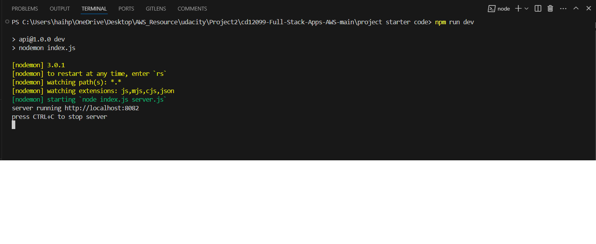

# Project: Image Processing Microservice on AWS
# Development Server
## 1. The project demonstrates a working NodeJS service
### Starting the server with npm run dev runs a local

## 2. The project demonstrates RESTFUL design principles
### The stubbed @TODO1 endpoint

### Accepts valid requests including: [Curl Local Link](http://localhost:8082/filteredimage?image_url=https://upload.wikimedia.org/wikipedia/commons/b/bd/Golden_tabby_and_white_kitten_n01.jpg)

## 3. The project demonstrates an appropriate use of HTTP status codes
###  Error code for caught errors 422

# Elastic Beanstalk Deployment
## 1. The project uses AWS Elastic Beanstalk’s CLI and Console Dashboard
### Beanstalk CLI eb init

### Beanstalk CLI eb create

### Beanstalk CLI eb deploy

## 2. A screenshot of the elastic beanstalk application dashboard:

## 3. The project includes functional cloud deployments
This endpoint responds to valid GET requests including: [GET requests](http://eb-image-processing-dev.us-east-1.elasticbeanstalk.com/filteredimage?image_url=https://upload.wikimedia.org/wikipedia/commons/b/bd/Golden_tabby_and_white_kitten_n01.jpg)
